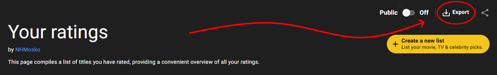

# Favorite Directors
A Python app for parsing IMDb ratings csv and generating a favorite director list, based on number of movies watched and average rating.
_this is the backend counterpart to [favorite-directors-visualizer](github.com/nhmosko/favorite-directors-visualizer)_


## How it works:
### 1. Export your IMDb ratings
Log in to imdb.com and navigate to your ratings page, then click on the export button on the top right corner (the export may take some time to complete).



When the export is complete, you'll be able to download it as a file named something like e342343c(...).csv.


### 2. Clone this repository and run the app
Standard github cloning, to run the program you'll need to have [Python](https://www.python.org/downloads/) installed.
It takes the CSV file of your IMDb ratings as a required argument and an optional flag: `--print` which makes it so the program nicely displays the data on the command line and `--only-print` which does the same, but keeps the app from generating the JSON file.
```
python <path_to_app.py> <path_to_imdb-export.csv> <optional: --print or --only-print>
```
If not set as `--only-print`, this will generate a JSON file containing a list of your favorite directors: `favorite_directors.json` which can be used as input on the visualizer website.

_The generated list only takes into account directors who you have rated at least 3 titles from._

### 3. Go to [nhmosko.github.io/favorite-directors-visualizer](nhmosko.github.io/favorite-directors-visualizer) _!!! not yet implemented_
There you can interact with your data, change filters, play with parameters and create graphs.


